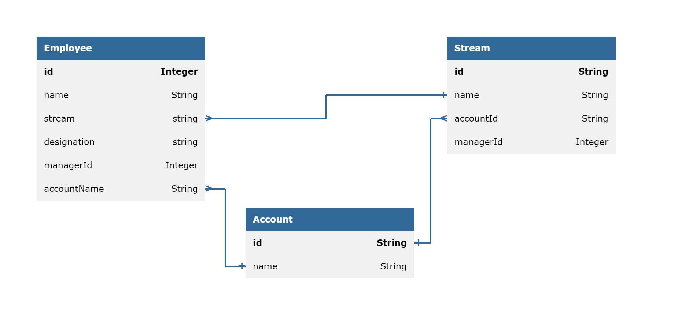

# API Design Document
## Employee

### API Methods



1. **Get Employees whose name starts with character** 
    - endpoint : /api/employees/?starts-with={char}
    - query-param-required : false
    - response-status : 200
    - method : GET
    - response : list of employee details as JSON
    ```json
   {
      "employees" : [
        {
            "id" : 4,
            "name" : "Sandra",
            "designation" : "Associate",
            "stream" : "sales",
            "accountName" : "smart ops",
            "managerId" : 1
        },
        {
            "id" : 1,
            "name" : "Sasi",
            "designation" : "Manager",
            "stream" : "sales",
            "accountName" : "smart ops",
            "managerId" : 0
        }
    ]
   }
    ```
2. **Get All Streams** 
    - endpoint : /api/streams
    - response-status : 200
    - method : GET
    - response : streams as JSON
    ```json
    {
         "streams" : ["sales","engineering","marketing"]
    }
    ```
3. **Update Employee**
   - endpoint : /api/employee/update/?employeeId={emp-id}&managerId={mgr-id}
   - query-param-required : true
   - response-status : 200
   - method : PUT
   - response : message 
   ```json
   {
     "message" : "Arun’s Manager has been changed from Amal to Akhil"
   }
    ```

4. **Delete Employee** 
    - endpoint : /api/employee/delete/?employeeId={emp-id}
    - query-param-required : true
    - response-status : 200
    - method : DELETE
    - response : message 
   ```json
   {
       "message" : "Successfully deleted Arun"
   }
   ```

5. **Add an employee** 
    - endpoint : /api/employee/add
    - request-body :
   ```json
   {
        "name" : "Aswin",
        "stream" : "Sales",
        "designation" : "Manager",
        "managerId" : 0,
        "accountName" : "SmartOps"
   }
   ```
    - response-status : 201
    - method : POST
    - response : message 
   ```json
   {
       "message" : "Successfully added Aswin to organizations list"
   }
   ```
