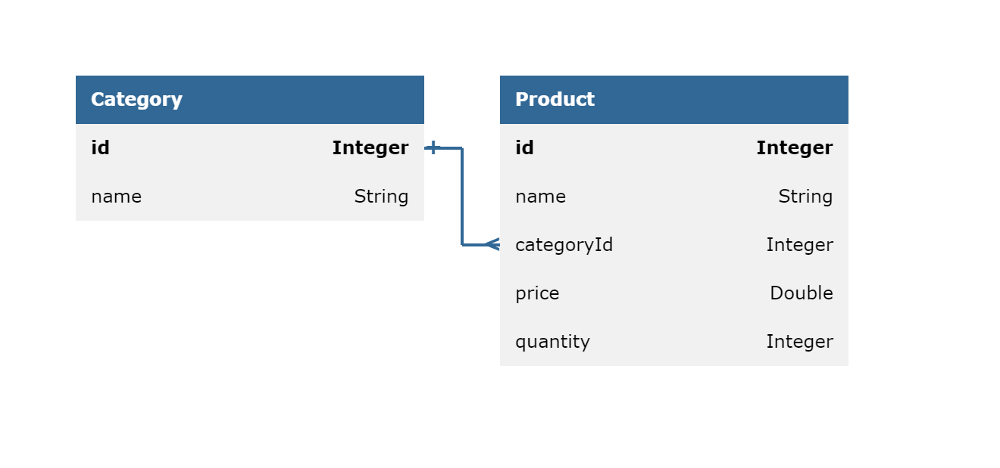

# API Design Document
## Inventory Management

### API Methods



1. **Add a product** 
    - endpoint : /api/products/add
    - request-body :
   ```json
   {
        "name" : "Laptop",
        "categoryId" : 1,
        "price" : 95000.00,
        "quantity" : 20
   }
   ```
    - response-status : 201
    - method : POST
    - response : message 
   ```json
   {
       "message" : "Product with id 101 added successfully"
   }
   ```
2. **Get all products, product by id, product by categoryId**
   - endpoint : /api/products/get/?productId={product-id}&categoryId={category-id}
   - query-param-required : false
   - response-status : 200
   - method : GET
   - response : message showing if the update is success or not
   ```json
   {
        "products" : 
     [
         {
             "id" : 101,
             "name" : "laptop",
             "categoryId" : 1,
             "price" : 95000.00,
             "quantity" : 100
         },
         {
             "id" : 102,
             "name" : "smartphone",
             "categoryId" : 2,
             "price" : 55000.00,
             "quantity" : 100
         }
     ]
   }
    ```
3. **Update Product**
   - endpoint : /api/products/update/?productId={product-id}&categoryId={category-id}&name={product-name}&price={product-price}
   - query-param : productId(required : true)
   - query-param : name(required : false)
   - query-param : categoryId(required : false)
   - query-param : price(required : false)
   - response-status : 200
   - method : PUT
   - response : message 
   ```json
   {
     "message" : "Product with id 102 updated successfully"
   }
    ```
4. **Delete Product** 
    - endpoint : /api/products/delete/?productId={product-id}
    - query-param-required : true
    - response-status : 200
    - method : DELETE
    - response : message 
   ```json
   {
       "message" : "Product with id 102 deleted successfully"
   }
   
5. **Create a category** 
     - endpoint : /api/categories/add
     - request-body :
    ```json
    {
         "name" : "Gadgets"
    }
    ```
     - response-status : 201
     - method : POST
     - response : message 
    ```json
    {
        "message" : "Category with id 1 added successfully"
    }
    ```
6. **Get all categories, category details by id**
   - endpoint : /api/categories/get/?categoryId={category-id}
   - query-param-required : false
   - response-status : 200
   - method : GET
   - response : message 
   ```json
   {
       "categories" : ["make-up","gadgets","accessories"]
   }
   ```
7. **Update Category**
   - endpoint : /api/categories/update/?categoryId={category-id}&name={category-name}
   - query-param-required : true
   - response-status : 200
   - method : PUT
   - response : message 
   ```json
   {
     "message" : "Category name changed from Gadgets to Electronics"
   }
    ```
8. **Delete Category** 
    - endpoint : /api/categories/delete/?categoryId={category-id}
    - query-param-required : true
    - response-status : 200
    - method : DELETE
    - response : message 
   ```json
   {
       "message" : "Category Gadgets deleted successfully"
   }
   ```
9. **Sell products**
    - endpoint : /api/products/sell/?productId={product-id}&quantity={sell-quantity}
    - query-param-required : true
    - response-status : 200
    - method : PUT
    - response : message 
   ```json
   {
       "message" : "5 Units of Laptop sold successfully"
   }
   ```
10. **Restock products**
    - endpoint : /api/products/restock/?productId={product-id}&quantity={restock-quantity}
    - query-param-required : true
    - response-status : 200
    - method : PUT
    - response : message 
   ```json
   {
       "message" : "5 Units of Laptop restocked successfully"
   }
   ```